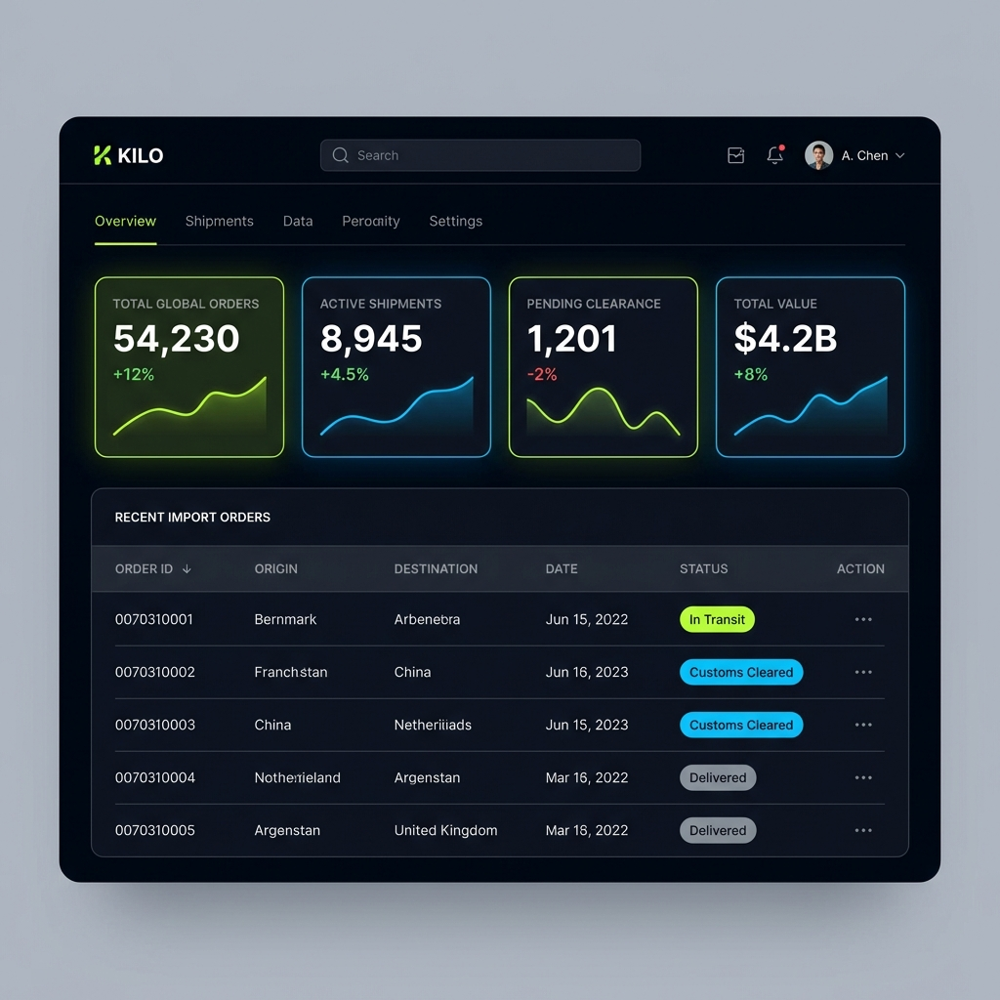
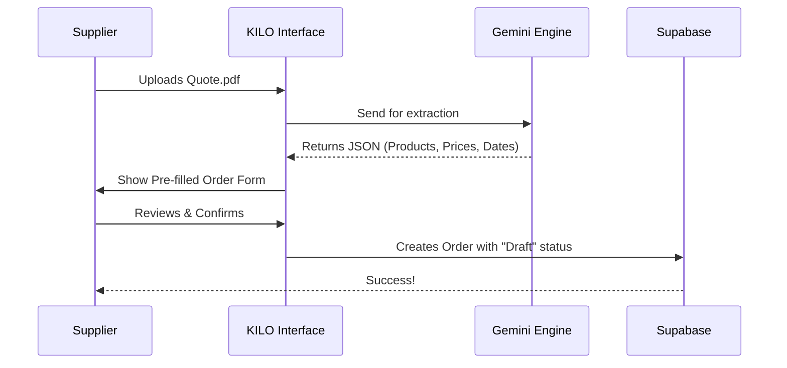

# KILO - Intelligent International Trade Operations Platform



## 🌍 Overview
**KILO** is a next-generation platform designed to revolutionize international trade logistics. By bridging the gap between Importers, Suppliers, and Brokers, KILO automates the complex workflows of global commerce.

The platform leverages **AI-driven document processing** to turn unstructured data (PDF quotes, packing lists) into structured orders, reducing manual entry errors by 95% and accelerating the procurement cycle.

## 🚀 Key Features

### 🏢 For Importers
- **Centralized Dashboard**: Real-time view of all active shipments, financial exposure, and pending tasks.
- **Smart Order Management**: Track orders from `Draft` -> `Production` -> `Shipping` -> `Delivered`.
- **Document Hub**: Secure repository for all trade documents (BL, Invoice, Packing List) linked to specific orders.

### 🏭 For Suppliers
- **Smart Order Creation**: **(New Feature)** Drag & Drop PDF Quotes to automatically generate digital orders using AI.
- **Production Tracking**: Update order status milestones to keep importers informed.
- **Direct Communication**: Contextualized document sharing and updates.

### ⚖️ For Brokers
- **Customs Clearance Workflow**: Streamlined access to necessary documentation for faster goods release.

## 🧠 Smart AI Integration

KILO uses advanced LLMs (Gemini) to process trade documents.

### Smart Order Flow
Instead of manually typing order details, suppliers simply upload a Quote PDF.




## 🛠 Tech Stack

- **Framework**: [Next.js 14](https://nextjs.org/) (App Router, Server Components)
- **Database**: [Supabase](https://supabase.com/) (PostgreSQL, Auth, Storage)
- **Styling**: [Tailwind CSS](https://tailwindcss.com/) + Shadcn/UI
- **AI**: Google Gemini Pro (via Make.com webhook)
- **Language**: TypeScript

## 📂 Project Structure

```
├── app/
│   ├── dashboard/       # Specialized views for each role
│   │   ├── importer/    # Importer functionalities
│   │   ├── supplier/    # Supplier functionalities
│   │   └── broker/      # Broker functionalities
│   ├── auth/            # Authentication routes
│   └── api/             # Backend API routes
├── components/          # Reusable UI components
├── lib/
│   └── supabase/        # Database clients and types
├── types/               # TypeScript definitions
└── public/              # Static assets
```

## 🚦 Getting Started

1. **Clone the repository**
   ```bash
   git clone https://github.com/ItaiRahamim/KILO.git
   cd KILO
   ```

2. **Install dependencies**
   ```bash
   npm install
   ```

3. **Set up Environment**
   Create a `.env.local` file with your credentials:
   ```env
   NEXT_PUBLIC_SUPABASE_URL=your_url
   NEXT_PUBLIC_SUPABASE_ANON_KEY=your_key
   ```

4. **Run Development Server**
   ```bash
   npm run dev
   ```

## 🔮 Future Roadmap
- [ ] Integration with Shipping Line APIs for real-time tracking
- [ ] Multi-currency financial reconciling
- [ ] Mobile App for on-the-go management

---
*Built with ❤️ for Global Trade*
